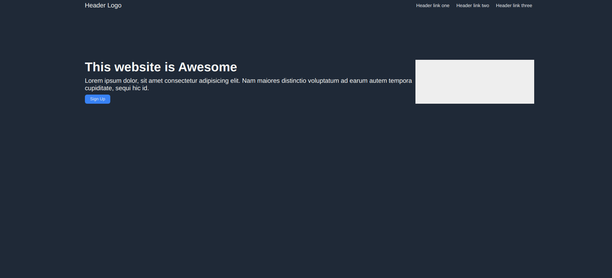
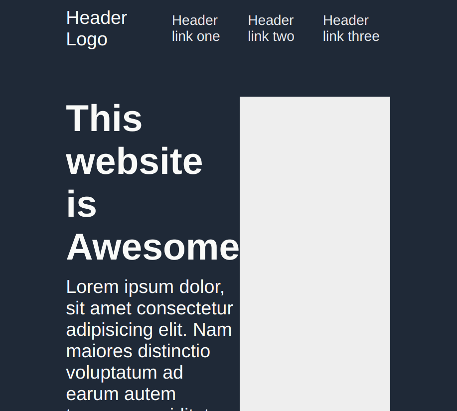

# The Odin Project - Landing Page
This project is a simple layout of a landing page using flexbox.

## Description
It is a part of [The Odin Project](https://www.theodinproject.com/lessons/foundations-landing-page)
 course for web development.

## Tech and Tools:
- html
- CSS
- VS Code
- Oracle VM Virtual Box
- Git
- Github

### Motivation 
This project was built to understand the concepts of flexbox in depth, while practicing a real-world example.
It definitely worked to  a great extent to remove the gap between theory and practice.

### Challanges

The concept of flexbox has always been somewhat confusing to me. While I understood most of the functionalities, I have yet to overcome my fear of using `flex`. This has made the [header](index.html) look very unresponsive on other screens sizes.

### Future plans for this project 
* The page was meant to be designed for a laptop screens, therefore, it is not responsive yet. It will be improved to adapt to other screen sizes.
* Instead of using dummy content, this project will be turned into a functional webpage.

## Credits
[Photo](https://www.pexels.com/photo/milky-way-galaxy-above-a-rock-formation-5117913/) by Alex Azabache 

[Photo](https://www.pexels.com/photo/body-of-water-2524874/) by Jeremy Bishop 

[Photo](https://www.pexels.com/photo/green-grass-near-trees-1770809/) by Luis Dalvan 

[Photo](https://www.pexels.com/photo/person-standing-on-sand-during-night-time-4591254/) by Movoyagee 